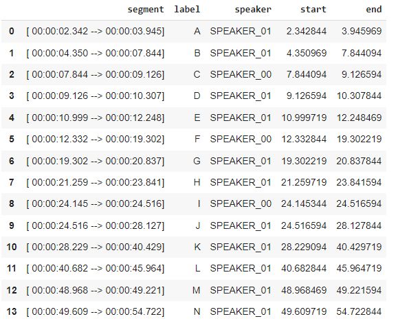

# Speaker Diarization

Speaker Diarization is the process of partitioning an audio stream into homogeneous segments according to the identity of the speaker. It answers the question "who spoke when?" in a given audio or video recording. This is a crucial step in many speech processing applications, such as transcription, speaker recognition, and meeting analysis.

Speaker Diarization at Sunbird is performed using pyannote's speaker-diarization-3.0 as the main tool for identifying speakers and the text that corresponds to them along with the Sunbird mms that aids in transcription of the text in the audio.

## Framework

**Setup and Installation**

The necessary libraries to perform speaker diarization required for efficient execution of the pipeline and determine various metrics are installed and imported.

```python
!pip install pyctcdecode
!pip install kenlm
!pip install jiwer
!pip install huggingface-hub
!pip install transformers
!pip install pandas
!pip install pyannote.audio
!pip install onnxruntime


import torch
from huggingface_hub import hf_hub_download
from transformers import (
    Wav2Vec2ForCTC,
    Wav2Vec2CTCTokenizer,
    Wav2Vec2FeatureExtractor,
    Wav2Vec2Processor,
    Wav2Vec2ProcessorWithLM,
    AutomaticSpeechRecognitionPipeline,
    AutoProcessor
)
from pyctcdecode import build_ctcdecoder
from jiwer import wer

import os
import csv
import pandas as pd
```

**Loading Models and LM Heads**

The Sunbird mms is a huggingface repository with a variety of models and adapters optimized for transcription and translation of languages. Currently, the Diarization developed caters for three languages English, Luganda and Acholi.

```python
device = torch.device("cuda" if torch.cuda.is_available() else "cpu")

lang_config = {
    "ach": "Sunbird/sunbird-mms",
    "lug": "Sunbird/sunbird-mms",
    "eng": "Sunbird/sunbird-mms",
}
model_id = "Sunbird/sunbird-mms"
model = Wav2Vec2ForCTC.from_pretrained(model_id).to(device)
```

#### Processor Setup

```python
processor = AutoProcessor.from_pretrained(model_id)
tokenizer = Wav2Vec2CTCTokenizer.from_pretrained(model_id)
```

#### Tokenizer setup

```python 
tokenizer.set_target_lang("eng")
model.load_adapter("eng_meta")
```

#### Feature extractor setup

```python
feature_extractor = Wav2Vec2FeatureExtractor(
    feature_size=1, sampling_rate=16000, padding_value=0.0, do_normalize=True, return_attention_mask=True
)
processor = Wav2Vec2Processor(feature_extractor=feature_extractor, tokenizer=tokenizer)
vocab_dict = processor.tokenizer.get_vocab()
sorted_vocab_dict = {k.lower(): v for k, v in sorted(vocab_dict.items(), key=lambda item: item[1])}
```

#### Language model file setup
Within the `Sunbird/sunbird-mms` huggingface repository is a subfolder named `language_model` containing various language models capable of efficient transcription.

```python
lm_file_name = "eng_3gram.bin"
lm_file_subfolder = "language_model"
lm_file = hf_hub_download(
    repo_id=lang_config["eng"],
    filename=lm_file_name,
    subfolder=lm_file_subfolder,
)
```

#### Decoder setup -> Use KenLM as decoder

```python
decoder = build_ctcdecoder(
    labels=list(sorted_vocab_dict.keys()),
    kenlm_model_path=lm_file,
)
```

#### Use the lm as the Processor

```python
processor_with_lm = Wav2Vec2ProcessorWithLM(
    feature_extractor=feature_extractor,
    tokenizer=tokenizer,
    decoder=decoder,
)
feature_extractor._set_processor_class("Wav2Vec2ProcessorWithLM")
```

#### ASR Pipeline, with a chunk and stride

The ASR pipeline is initialized with the pretrained `Sunbird-mms` model, `processor_with_lm` attributes `tokenizer`, `feature_extractor` and `decoder`, respective device, `chunch_length_s`, `stride_length_s` and `return_timestamps`

```python
pipe = AutomaticSpeechRecognitionPipeline(
    model=model,
    tokenizer=processor_with_lm.tokenizer,    feature_extractor=processor_with_lm.feature_extractor,
    decoder=processor_with_lm.decoder,
    device=device,
    chunk_length_s=10,
    stride_length_s=(4, 2),
    return_timestamps="word"
)
```

**Performing a transcription**

```python
 transcription = pipe("/content/kitakas_eng.mp3")
```

 The resulting dictionary `transcription` will contain a `text` key containing all the transcribed text as well as a `chunks` containing individual texts along with their time stamps of the format below:

```python
 {
    'text' : 'Hello world',
    'chunks': [
        {'text': 'Hello','timestamp': (0.5, 1.0)},
        {'text': 'world','timestamp': (1.5, 2.0)}
        ]
}
```

#### Diarization

**Imports**

```python
from typing import Optional, Union
import numpy as np
from pyannote.audio import Pipeline
import librosa
```

**Loading an audio file**

```python
SAMPLE_RATE = 16000

def load_audio(file: str, sr: int = SAMPLE_RATE) -> np.ndarray:
    
    try:
        # librosa automatically resamples to the given sample rate (if necessary)
        # and converts the signal to mono (by averaging channels)
        audio, _ = librosa.load(file, sr=sr, mono=True, dtype=np.float32)
    except Exception as e:
        raise RuntimeError(f"Failed to load audio with librosa: {e}") from e

    return audio
```
The `load_audio` functions takes an audio file and sampling rate as one of its parameters. The sampling rate used for this Speaker Diarization is 16000. This sampling rate should be the same sampling rate used to transcribe the audio from using the Sunbird mms to ensure consistency with the output.

**Diarization Pipeline**

The class `Diarization Pipeline` is a custom class created to facilitate the diarization task. It initializes with a pretrained model and can be called with an audio file or waveform to perform diarization.

It returns a pandas DataFrame with with columns for the segment, label, speaker, start time, and end time of each speaker segment.


```python
class DiarizationPipeline:
    def __init__(
        self,
        model_name="pyannote/speaker-diarization-3.0",
        use_auth_token=None,
        device: Optional[Union[str, torch.device]] = "cpu",
    ):
        if isinstance(device, str):
            device = torch.device(device)
        self.model = Pipeline.from_pretrained(model_name,
        use_auth_token=use_auth_token).to(device)

    def __call__(
        self,
        audio: Union[str, np.ndarray],
        min_speakers: Optional[int] = None,
        max_speakers: Optional[int] = None
    ) -> pd.DataFrame:

        if isinstance(audio, str):
            audio = load_audio(audio)
        audio_data = {
            'waveform': torch.from_numpy(audio[None, :]),
            'sample_rate': SAMPLE_RATE
        }
        segments = self.model(audio_data, min_speakers=min_speakers, max_speakers=max_speakers)
        diarize_df = pd.DataFrame(segments.itertracks(yield_label=True), columns=['segment', 'label', 'speaker'])
        diarize_df['start'] = diarize_df['segment'].apply(lambda x: x.start)
        diarize_df['end'] = diarize_df['segment'].apply(lambda x: x.end)
        return diarize_df
```

**Segment**

A class to represent a single segment of an audio with start time, end time and speaker label.

This class to encapsulates the information about a segment of audio that has been identified during a speaker diarization process, including the time the segment starts, when it ends, and which speaker is speaking.

```python
class Segment:
    def __init__(self, start, end, speaker=None):
        self.start = start
        self.end = end
        self.speaker = speaker
```

**Assigning Speakers**

This is the process that involves taking the transcribed chunks and assigning them to the speakers discovered by the Speaker Diarization Pipeline.

In this function, timestamps of the different chunks are compared against the start and end times of speakers in the DataFrame returned by the `SpeakerDiarization` pipeline segments of a transcript are assigned speaker labels based on the overlap between the speech segments and diarization data.

The function iterates through segments of a transcript and assigns the speaker labels based on the overlap between the speech segments and the diarization data.

In case of no overlap, a the fill_nearest parameter can be set to `True`, then the function will assign the speakers to segments by finding the closest speaker in time.

The function takes parameters:
    
`diarize_df`: a pandas DataFrame returned by the DiarizationPipeline containing the diarization information with columns like `start`, `end` and `speaker`

`transcript_result`: A dictionary with a key `chunks` that contains a list of trancript `Segments` obtained from the ASR pipeline.

`fill_nearest`: Default is `False`

`Returns:` An updated `transcript_result` with speakers assigned to each segment in the form:

```python
{
    'text':'Hello World',
    'chunks':[
        {'text': 'Hello', 'timestamp': (0.5, 1.0), 'speaker': 0},
        {'text': 'world', 'timestamp': (1.5, 2.0), 'speaker': 1}
    ]
}
```

```python

def assign_word_speakers(diarize_df, transcript_result, fill_nearest=False):
 
    transcript_segments = transcript_result["chunks"]

    for seg in transcript_segments:
        # Calculate intersection and union between diarization segments and transcript segment
        diarize_df['intersection'] = np.minimum(diarize_df['end'], seg["timestamp"][1]) - np.maximum(diarize_df['start'], seg["timestamp"][0])
        diarize_df['union'] = np.maximum(diarize_df['end'], seg["timestamp"][1]) - np.minimum(diarize_df['start'], seg["timestamp"][0])

        # Filter out diarization segments with no overlap if fill_nearest is False
        if not fill_nearest:
            dia_tmp = diarize_df[diarize_df['intersection'] > 0]
        else:
            dia_tmp = diarize_df

        # If there are overlapping segments, assign the speaker with the greatest overlap
        if len(dia_tmp) > 0:
            speaker = dia_tmp.groupby("speaker")["intersection"].sum().sort_values(ascending=False).index[0]
            seg["speaker"] = speaker

    return transcript_result

```

**Running the diarization model**
```python
diarize_model = DiarizationPipeline(use_auth_token=hf_token, device=device)
diarize_segments = diarize_model("/content/kitakas_eng.mp3", min_speakers=1, max_speakers=2)

diarize_segments
```

**Sample Output**



```python
output = assign_word_speakers(diarize_segments, transcription)
output
```

**Sample Output after Assigning Speakers**

```python
{'text': "this is the chitaka's podcast my husband and i will be letting in honor life as a couple husband and helper husband and wife as husband and wife marriage is not a new wild you enter into you don't become a new person you come with what you been working on it's easy to go through the first year of your marriage trying to knit pick the shortcomings of your partner now this is our first episode and it's a series of random reflections from our one year in marriage now we hope that as we share experiences and insights on our journey the you will be inspired to pursue the potion and purpose to your marriage so this is the chitaka'spodcast and these are random reflections when you are married",
 'chunks': [{'text': 'this',
   'timestamp': (2.42, 2.58),
   'speaker': 'SPEAKER_01'},
  {'text': 'is', 'timestamp': (2.68, 2.72), 'speaker': 'SPEAKER_01'},
  {'text': 'the', 'timestamp': (2.78, 2.84), 'speaker': 'SPEAKER_01'},
  {'text': "chitaka's", 'timestamp': (2.9, 3.32), 'speaker': 'SPEAKER_01'},
  {'text': 'podcast', 'timestamp': (3.38, 3.86), 'speaker': 'SPEAKER_01'},
  {'text': 'my', 'timestamp': (4.4, 4.48), 'speaker': 'SPEAKER_01'},
  {'text': 'husband', 'timestamp': (4.52, 4.72), 'speaker': 'SPEAKER_01'},
  {'text': 'and', 'timestamp': (4.8, 4.86), 'speaker': 'SPEAKER_01'},
  {'text': 'i', 'timestamp': (4.96, 4.98), 'speaker': 'SPEAKER_01'},
  {'text': 'will', 'timestamp': (5.1, 5.22), 'speaker': 'SPEAKER_01'},
  {'text': 'be', 'timestamp': (5.28, 5.32), 'speaker': 'SPEAKER_01'},
  {'text': 'letting', 'timestamp': (5.38, 5.64), 'speaker': 'SPEAKER_01'},
  {'text': 'in', 'timestamp': (5.82, 5.86), 'speaker': 'SPEAKER_01'},
  {'text': 'honor', 'timestamp': (6.06, 6.32), 'speaker': 'SPEAKER_01'},
  {'text': 'life', 'timestamp': (6.42, 6.7), 'speaker': 'SPEAKER_01'},
  {'text': 'as', 'timestamp': (6.82, 6.9), 'speaker': 'SPEAKER_01'},
  {'text': 'a', 'timestamp': (6.98, 7.0), 'speaker': 'SPEAKER_01'},
  {'text': 'couple', 'timestamp': (7.14, 7.52), 'speaker': 'SPEAKER_01'},
  {'text': 'husband', 'timestamp': (8.06, 8.36), 'speaker': 'SPEAKER_00'},
  {'text': 'and', 'timestamp': (8.44, 8.5), 'speaker': 'SPEAKER_00'},
  {'text': 'helper', 'timestamp': (8.64, 9.02), 'speaker': 'SPEAKER_00'},
  {'text': 'husband', 'timestamp': (9.36, 9.68), 'speaker': 'SPEAKER_01'},
  {'text': 'and', 'timestamp': (9.76, 9.84), 'speaker': 'SPEAKER_01'},
  {'text': 'wife', 'timestamp': (9.94, 10.3), 'speaker': 'SPEAKER_01'},
  {'text': 'as', 'timestamp': (11.06, 11.14), 'speaker': 'SPEAKER_01'},
  {'text': 'husband', 'timestamp': (11.24, 11.56), 'speaker': 'SPEAKER_01'},
  {'text': 'and', 'timestamp': (11.62, 11.7), 'speaker': 'SPEAKER_01'},
  {'text': 'wife', 'timestamp': (11.76, 12.04), 'speaker': 'SPEAKER_01'},
  {'text': 'marriage', 'timestamp': (12.48, 12.82), 'speaker': 'SPEAKER_00'},
  {'text': 'is', 'timestamp': (12.88, 12.94), 'speaker': 'SPEAKER_00'},
  {'text': 'not', 'timestamp': (13.12, 13.48), 'speaker': 'SPEAKER_00'},
  {'text': 'a', 'timestamp': (13.78, 13.8), 'speaker': 'SPEAKER_00'},
  {'text': 'new', 'timestamp': (13.92, 14.06), 'speaker': 'SPEAKER_00'},
  {'text': 'wild', 'timestamp': (14.16, 14.42), 'speaker': 'SPEAKER_00'},
  {'text': 'you', 'timestamp': (14.5, 14.56), 'speaker': 'SPEAKER_00'},
  {'text': 'enter', 'timestamp': (14.64, 14.82), 'speaker': 'SPEAKER_00'},
  {'text': 'into', 'timestamp': (14.94, 15.2), 'speaker': 'SPEAKER_00'},
  {'text': 'you', 'timestamp': (15.38, 15.44), 'speaker': 'SPEAKER_00'},
  {'text': "don't", 'timestamp': (15.5, 15.64), 'speaker': 'SPEAKER_00'},
  {'text': 'become', 'timestamp': (15.74, 15.98), 'speaker': 'SPEAKER_00'},
  {'text': 'a', 'timestamp': (16.06, 16.08), 'speaker': 'SPEAKER_00'},
  {'text': 'new', 'timestamp': (16.18, 16.28), 'speaker': 'SPEAKER_00'},
  {'text': 'person', 'timestamp': (16.42, 16.86), 'speaker': 'SPEAKER_00'},
  {'text': 'you', 'timestamp': (17.2, 17.26), 'speaker': 'SPEAKER_00'},
  {'text': 'come', 'timestamp': (17.44, 17.64), 'speaker': 'SPEAKER_00'},
  {'text': 'with', 'timestamp': (17.72, 17.82), 'speaker': 'SPEAKER_00'},
  {'text': 'what', 'timestamp': (17.92, 18.02), 'speaker': 'SPEAKER_00'},
  {'text': 'you', 'timestamp': (18.12, 18.18), 'speaker': 'SPEAKER_00'},
  {'text': 'been', 'timestamp': (18.34, 18.46), 'speaker': 'SPEAKER_00'},
  {'text': 'working', 'timestamp': (18.54, 18.86), 'speaker': 'SPEAKER_00'},
  {'text': 'on', 'timestamp': (18.96, 19.12), 'speaker': 'SPEAKER_00'},
  {'text': "it's", 'timestamp': (19.42, 19.52), 'speaker': 'SPEAKER_01'},
  {'text': 'easy', 'timestamp': (19.64, 19.78), 'speaker': 'SPEAKER_01'},
  {'text': 'to', 'timestamp': (19.9, 19.96), 'speaker': 'SPEAKER_01'},
  {'text': 'go', 'timestamp': (20.12, 20.16), 'speaker': 'SPEAKER_01'},
  {'text': 'through', 'timestamp': (20.36, 20.62), 'speaker': 'SPEAKER_01'},
  {'text': 'the', 'timestamp': (21.32, 21.38), 'speaker': 'SPEAKER_01'},
  {'text': 'first', 'timestamp': (21.44, 21.64), 'speaker': 'SPEAKER_01'},
  {'text': 'year', 'timestamp': (21.7, 21.82), 'speaker': 'SPEAKER_01'},
  {'text': 'of', 'timestamp': (21.86, 21.9), 'speaker': 'SPEAKER_01'},
  {'text': 'your', 'timestamp': (21.96, 22.08), 'speaker': 'SPEAKER_01'},
  {'text': 'marriage', 'timestamp': (22.14, 22.42), 'speaker': 'SPEAKER_01'},
  {'text': 'trying', 'timestamp': (22.54, 22.74), 'speaker': 'SPEAKER_01'},
  {'text': 'to', 'timestamp': (22.84, 22.88), 'speaker': 'SPEAKER_01'},
  {'text': 'knit', 'timestamp': (23.2, 23.42), 'speaker': 'SPEAKER_01'},
  {'text': 'pick', 'timestamp': (23.6, 23.78), 'speaker': 'SPEAKER_01'},
  {'text': 'the', 'timestamp': (24.58, 24.64), 'speaker': 'SPEAKER_01'},
  {'text': 'shortcomings', 'timestamp': (24.7, 25.2), 'speaker': 'SPEAKER_01'},
  {'text': 'of', 'timestamp': (25.26, 25.3), 'speaker': 'SPEAKER_01'},
  {'text': 'your', 'timestamp': (25.36, 25.46), 'speaker': 'SPEAKER_01'},
  {'text': 'partner', 'timestamp': (25.52, 25.86), 'speaker': 'SPEAKER_01'},
  {'text': 'now', 'timestamp': (26.28, 26.38), 'speaker': 'SPEAKER_01'},
  {'text': 'this', 'timestamp': (26.46, 26.54), 'speaker': 'SPEAKER_01'},
  {'text': 'is', 'timestamp': (26.62, 26.68), 'speaker': 'SPEAKER_01'},
  {'text': 'our', 'timestamp': (26.74, 26.82), 'speaker': 'SPEAKER_01'},
  {'text': 'first', 'timestamp': (26.92, 27.12), 'speaker': 'SPEAKER_01'},
  {'text': 'episode', 'timestamp': (27.24, 27.68), 'speaker': 'SPEAKER_01'},
  {'text': 'and', 'timestamp': (27.82, 28.04), 'speaker': 'SPEAKER_01'},
  {'text': "it's", 'timestamp': (28.48, 28.6), 'speaker': 'SPEAKER_01'},
  {'text': 'a', 'timestamp': (28.66, 28.68), 'speaker': 'SPEAKER_01'},
  {'text': 'series', 'timestamp': (28.74, 28.96), 'speaker': 'SPEAKER_01'},
  {'text': 'of', 'timestamp': (29.0, 29.04), 'speaker': 'SPEAKER_01'},
  {'text': 'random', 'timestamp': (29.14, 29.4), 'speaker': 'SPEAKER_01'},
  {'text': 'reflections', 'timestamp': (29.5, 30.04), 'speaker': 'SPEAKER_01'},
  {'text': 'from', 'timestamp': (30.2, 30.3), 'speaker': 'SPEAKER_01'},
  {'text': 'our', 'timestamp': (30.38, 30.52), 'speaker': 'SPEAKER_01'},
  {'text': 'one', 'timestamp': (30.7, 30.82), 'speaker': 'SPEAKER_01'},
  {'text': 'year', 'timestamp': (30.9, 31.08), 'speaker': 'SPEAKER_01'},
  {'text': 'in', 'timestamp': (31.26, 31.34), 'speaker': 'SPEAKER_01'},
  {'text': 'marriage', 'timestamp': (31.44, 31.82), 'speaker': 'SPEAKER_01'},
  {'text': 'now', 'timestamp': (31.92, 32.02), 'speaker': 'SPEAKER_01'},
  {'text': 'we', 'timestamp': (32.14, 32.22), 'speaker': 'SPEAKER_01'},
  {'text': 'hope', 'timestamp': (32.36, 32.54), 'speaker': 'SPEAKER_01'},
  {'text': 'that', 'timestamp': (32.66, 32.82), 'speaker': 'SPEAKER_01'},
  {'text': 'as', 'timestamp': (32.96, 33.02), 'speaker': 'SPEAKER_01'},
  {'text': 'we', 'timestamp': (33.08, 33.14), 'speaker': 'SPEAKER_01'},
  {'text': 'share', 'timestamp': (33.24, 33.44), 'speaker': 'SPEAKER_01'},
  {'text': 'experiences',
   'timestamp': (33.58, 34.14),
   'speaker': 'SPEAKER_01'},
  {'text': 'and', 'timestamp': (34.2, 34.26), 'speaker': 'SPEAKER_01'},
  {'text': 'insights', 'timestamp': (34.34, 34.74), 'speaker': 'SPEAKER_01'},
  {'text': 'on', 'timestamp': (34.9, 34.98), 'speaker': 'SPEAKER_01'},
  {'text': 'our', 'timestamp': (35.06, 35.16), 'speaker': 'SPEAKER_01'},
  {'text': 'journey', 'timestamp': (35.22, 35.54), 'speaker': 'SPEAKER_01'},
  {'text': 'the', 'timestamp': (36.0, 36.08), 'speaker': 'SPEAKER_01'},
  {'text': 'you', 'timestamp': (36.22, 36.32), 'speaker': 'SPEAKER_01'},
  {'text': 'will', 'timestamp': (36.44, 36.56), 'speaker': 'SPEAKER_01'},
  {'text': 'be', 'timestamp': (36.64, 36.68), 'speaker': 'SPEAKER_01'},
  {'text': 'inspired', 'timestamp': (36.76, 37.24), 'speaker': 'SPEAKER_01'},
  {'text': 'to', 'timestamp': (37.6, 37.64), 'speaker': 'SPEAKER_01'},
  {'text': 'pursue', 'timestamp': (37.7, 37.94), 'speaker': 'SPEAKER_01'},
  {'text': 'the', 'timestamp': (38.0, 38.06), 'speaker': 'SPEAKER_01'},
  {'text': 'potion', 'timestamp': (38.14, 38.46), 'speaker': 'SPEAKER_01'},
  {'text': 'and', 'timestamp': (38.5, 38.58), 'speaker': 'SPEAKER_01'},
  {'text': 'purpose', 'timestamp': (38.66, 39.06), 'speaker': 'SPEAKER_01'},
  {'text': 'to', 'timestamp': (39.4, 39.46), 'speaker': 'SPEAKER_01'},
  {'text': 'your', 'timestamp': (39.54, 39.66), 'speaker': 'SPEAKER_01'},
  {'text': 'marriage', 'timestamp': (39.86, 40.24), 'speaker': 'SPEAKER_01'},
  {'text': 'so', 'timestamp': (40.82, 40.9), 'speaker': 'SPEAKER_01'},
  {'text': 'this', 'timestamp': (41.42, 41.6), 'speaker': 'SPEAKER_01'},
  {'text': 'is', 'timestamp': (41.78, 41.84), 'speaker': 'SPEAKER_01'},
  {'text': 'the', 'timestamp': (41.94, 42.0), 'speaker': 'SPEAKER_01'},
  {'text': "chitaka'spodcast",
   'timestamp': (42.12, 43.16),
   'speaker': 'SPEAKER_01'},
  {'text': 'and', 'timestamp': (43.54, 43.62), 'speaker': 'SPEAKER_01'},
  {'text': 'these', 'timestamp': (43.7, 43.86), 'speaker': 'SPEAKER_01'},
  {'text': 'are', 'timestamp': (43.94, 44.02), 'speaker': 'SPEAKER_01'},
  {'text': 'random', 'timestamp': (44.1, 44.32), 'speaker': 'SPEAKER_01'},
  {'text': 'reflections', 'timestamp': (44.4, 44.88), 'speaker': 'SPEAKER_01'},
  {'text': 'when', 'timestamp': (45.28, 45.42), 'speaker': 'SPEAKER_01'},
  {'text': 'you', 'timestamp': (45.48, 45.54), 'speaker': 'SPEAKER_01'},
  {'text': 'are', 'timestamp': (45.56, 45.62), 'speaker': 'SPEAKER_01'},
  {'text': 'married', 'timestamp': (45.68, 45.92), 'speaker': 'SPEAKER_01'}]}
```