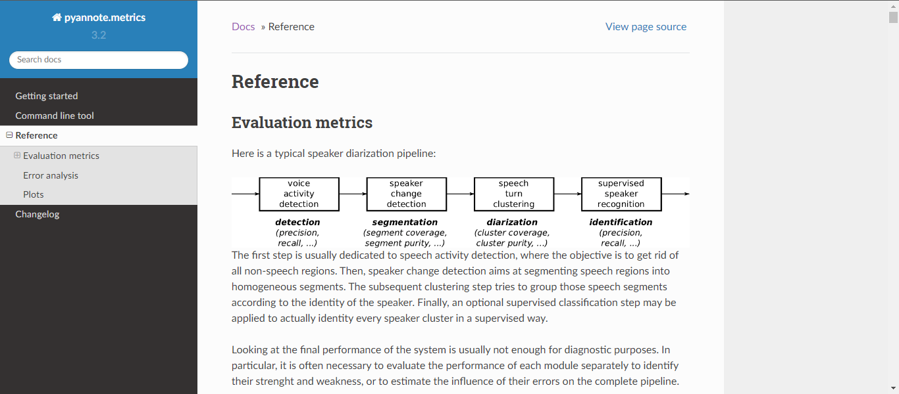

# Evaluating the Fine-Tuned Model

The script `test_segmentation.py` can be used to evaluate a fine-tuned model on a diarization dataset.

In the following example, we evaluate the fine-tuned model from the test split of the CallHome English Dataset.

```bash
python3 test_segmentation.py \
    --dataset_name=diarizers-community/callhome \
    --dataset_config_name=eng \
    --split_on_subset=data \
    --test_split_name=test \
    --model_name_or_path=diarizers-community/speaker-segmentation-fine-tuned-callhome-eng \
    --preprocessing_num_workers=2 \
    --evaluate_with_pipeline \
```

#### Sample Output


The output above is the default output that can be obtained using the default Evaluation Script.

This documentation further explores the evaluation process adding more to the metrics that can be measured during this process and highlighting the editing.

Considering there are many metrics that can be obtained throughout the diarization process as documented in the [`pyannote.audio.metrics` documentation](https://pyannote.github.io/pyannote-metrics/reference.html).



In this documentation, we'll focus on the Segmentation Precision, Segmentation Recall and Identification F1 Score.

#### Segmentation Precision and Recall

**Imports**

`Segment`: Speaker segmentation is the process of dividing an audio recording into segments based on the changing speakers’ identities. The goal of speaker segmentation is to determine the time boundaries where the speaker changes occur, effectively identifying the points at which one speaker’s speech ends, and another’s begins. That said, a `Segment` is a data structure with `start` and `end` time that will then be placed in a `Timeline`

`Timeline`: A data structure containing various segments. Reference timelines are provided in the ground truth and are compared against the predicted timelines to calculate `segmentation precision` and `segmentation recall`


```python
from pyannote.core import SlidingWindow, SlidingWindowFeature, Timeline, Segment
from pyannote.metrics import segmentation, identification
```

### **Testing the Segmentation Model**

**Initialization**

`class Test` : The Segmentation Model test implementation is carried out within the Test Class found in the `Test.py` file in `src/diarizers`

**Parameters**

`test_dataset`: The test dataset to be used. In this example, it will be the test split on the Callhome English dataset.

`model (SegmentationModel)`: The model is the finetuned model trained by the `train_segmentation.py` script.

`step (float, optional)`: Steps between successive generated audio chunks. Defaults to 2.5.

`metrics`: For this example, the metrics `segmentation_precision`,`segmentation_recall`,`recall_value`,`precision_value` and `count` have been added for the purpose of calculating the segmentation recall and precision of the Segmentation Model.

```python
class Test:

    def __init__(self, test_dataset, model, step=2.5):

        self.test_dataset = test_dataset
        self.model = model
        (self.device,) = get_devices(needs=1)
        self.inference = Inference(self.model, step=step, device=self.device)

        self.sample_rate = test_dataset[0]["audio"]["sampling_rate"]

        # Get the number of frames associated to a chunk:
        _, self.num_frames, _ = self.inference.model(
            torch.rand((1, int(self.inference.duration * self.sample_rate))).to(self.device)
        ).shape
        # compute frame resolution:
        self.resolution = self.inference.duration / self.num_frames

        self.metrics = {
            "der": DiarizationErrorRate(0.5).to(self.device),
            "confusion": SpeakerConfusionRate(0.5).to(self.device),
            "missed_detection": MissedDetectionRate(0.5).to(self.device),
            "false_alarm": FalseAlarmRate(0.5).to(self.device),
            "segmentation_precision": segmentation.SegmentationPrecision(),
            "segmentation_recall": segmentation.SegmentationRecall(),
            "recall_value":0,
            "precision_value": 0,
            "count": 0,
        }

```

**Predict function**

This function makes a prediction on a dataset row using pyannote inference object.

```python
    def predict(self, file):
        audio = torch.tensor(file["audio"]["array"]).unsqueeze(0).to(torch.float32).to(self.device)
        sample_rate = file["audio"]["sampling_rate"]

        input = {"waveform": audio, "sample_rate": sample_rate}

        prediction = self.inference(input)

        return prediction
```

**Compute Ground Truth Function**

This function converts a dataset row into the suitable format for evaluation as the ground truth.

`Returns`: numpy array with shape (num_frames, num_speakers).

```python
def compute_gt(self, file):

    audio = torch.tensor(file["audio"]["array"]).unsqueeze(0).to(torch.float32)
    sample_rate = file["audio"]["sampling_rate"]

    audio_duration = len(audio[0]) / sample_rate
    num_frames = int(round(audio_duration / self.resolution))

    labels = list(set(file["speakers"]))

    gt = np.zeros((num_frames, len(labels)), dtype=np.uint8)

    for i in range(len(file["timestamps_start"])):
        start = file["timestamps_start"][i]
        end = file["timestamps_end"][i]
        speaker = file["speakers"][i]
        start_frame = int(round(start / self.resolution))
        end_frame = int(round(end / self.resolution))
        speaker_index = labels.index(speaker)

        gt[start_frame:end_frame, speaker_index] += 1

    return gt
```

**Convert to Timeline**

This function creates a `Timeline` using data and labels passed as parameters and converted into `Segments`. Required in order to calculate Segmentation Precision and Recall.

```python
    def convert_to_timeline(self, data, labels):
        timeline = Timeline()
        for speaker_index, label in enumerate(labels):
            segments = np.where(data[:, speaker_index] == 1)[0]
            if len(segments) > 0:
                start = segments[0] * self.resolution
                end = segments[0] * self.resolution
                for frame in segments[1:]:
                    if frame == end / self.resolution + 1:
                        end += self.resolution
                    else:
                        timeline.add(Segment(start, end + self.resolution))
                        start = frame * self.resolution
                        end = frame * self.resolution
                timeline.add(Segment(start, end + self.resolution))
        return timeline
```

**Compute Metrics on File**

Function that computes metrics for a dataset row passed into it. This function is run iteratively until the entire dataset has been processed.

```python
    def compute_metrics_on_file(self, file):
        gt = self.compute_gt(file)
        prediction = self.predict(file)

        sliding_window = SlidingWindow(start=0, step=self.resolution, duration=self.resolution)
        labels = list(set(file["speakers"]))

        reference = SlidingWindowFeature(data=gt, labels=labels, sliding_window=sliding_window)

        # Convert to Timeline for SegmentationPrecision
        reference_timeline = self.convert_to_timeline(gt, labels)
        prediction_timeline = self.convert_to_timeline(prediction.data, labels)


        for window, pred in prediction:
            reference_window = reference.crop(window, mode="center")
            common_num_frames = min(self.num_frames, reference_window.shape[0])

            _, ref_num_speakers = reference_window.shape
            _, pred_num_speakers = pred.shape

            if pred_num_speakers > ref_num_speakers:
                reference_window = np.pad(reference_window, ((0, 0), (0, pred_num_speakers - ref_num_speakers)))
            elif ref_num_speakers > pred_num_speakers:
                pred = np.pad(pred, ((0, 0), (0, ref_num_speakers - pred_num_speakers)))

            pred = torch.tensor(pred[:common_num_frames]).unsqueeze(0).permute(0, 2, 1).to(self.device)
            target = (torch.tensor(reference_window[:common_num_frames]).unsqueeze(0).permute(0, 2, 1)).to(self.device)

            self.metrics["der"](pred, target)
            self.metrics["false_alarm"](pred, target)
            self.metrics["missed_detection"](pred, target)
            self.metrics["confusion"](pred, target)


        # Compute precision
        self.metrics["precision_value"] += self.metrics["segmentation_precision"](reference_timeline, prediction_timeline)
        self.metrics["recall_value"] += self.metrics["segmentation_recall"](reference_timeline, prediction_timeline)
        self.metrics["count"] += 1
```

**Compute Metrics**

Using all the functions above, the metrics for the Segmentation Model can then be computed and returned at once as shown below.

Further information on metrics that extracted from the Segmentation model can be found [here](https://pyannote.github.io/pyannote-metrics/reference.html#segmentation)

```python
    def compute_metrics(self):
        """Main method, used to compute speaker diarization metrics on test_dataset.
        Returns:
            dict: metric values.
        """

        for file in tqdm(self.test_dataset):
            self.compute_metrics_on_file(file)
        if self.metrics["count"] != 0:
            self.metrics["precision_value"] /= self.metrics["count"]
            self.metrics["recall_value"] /= self.metrics["count"]

        return {
            "der": self.metrics["der"].compute(),
            "false_alarm": self.metrics["false_alarm"].compute(),
            "missed_detection": self.metrics["missed_detection"].compute(),
            "confusion": self.metrics["confusion"].compute(),
            "segmentation_precision": self.metrics["precision_value"],
            "segmentation_recall": self.metrics["recall_value"],
        }
```

### Testing the Speaker Diarization (With the Fine-tuned Segmentation Model)

The Fine-tuned segmentation model can be run in the Speaker Diarization Pipeline by calling `from_pretrained` and overwriting the segmentation model with the fine-tuned model. Code can be found in the `Test.py` script.


```python
pipeline = Pipeline.from_pretrained("pyannote/speaker-diarization-3.1")
        pipeline._segmentation.model = model
```

**Initialization**

The class `TestPipeline` will be implementing and testing the Speaker Diarization Pipeline with the finetuned segmentation model.

**Parameters**

`pipeline`: Speaker Diarization pipeline

`test_dataset`: Data to be tested. In this example, it is data from the Callhome English dataset.

`metrics`: Since `pyannote.metrics` does not offer Identification F1-score, we'll use the Precision and Recall to calculate the `identificationF1Score`

```python
class TestPipeline:
    def __init__(self, test_dataset, pipeline) -> None:

        self.test_dataset = test_dataset

        (self.device,) = get_devices(needs=1)
        self.pipeline = pipeline.to(self.device)
        self.sample_rate = test_dataset[0]["audio"]["sampling_rate"]

        # Get the number of frames associated to a chunk:
        _, self.num_frames, _ = self.pipeline._segmentation.model(
            torch.rand((1, int(self.pipeline._segmentation.duration * self.sample_rate))).to(self.device)
        ).shape
        # compute frame resolution:
        self.resolution = self.pipeline._segmentation.duration / self.num_frames

        self.metrics = {
            "der": diarization.DiarizationErrorRate(),
            "identification_precision": identification.IdentificationPrecision(),
            "identification_recall": identification.IdentificationRecall(),
            "identification_f1": 0,

        }
```

**Compute Ground Truth**

Function that reformats the Dataset Row to return the ground truth to be used for evaluation.

**Parameters**

`file`: A single Dataset Row

```python
def compute_gt(self, file):

    """
    Args:
        file (_type_): dataset row.

    Returns:
        gt: numpy array with shape (num_frames, num_speakers).
    """

    audio = torch.tensor(file["audio"]["array"]).unsqueeze(0).to(torch.float32)
    sample_rate = file["audio"]["sampling_rate"]

    audio_duration = len(audio[0]) / sample_rate
    num_frames = int(round(audio_duration / self.resolution))

    labels = list(set(file["speakers"]))

    gt = np.zeros((num_frames, len(labels)), dtype=np.uint8)

    for i in range(len(file["timestamps_start"])):
        start = file["timestamps_start"][i]
        end = file["timestamps_end"][i]
        speaker = file["speakers"][i]
        start_frame = int(round(start / self.resolution))
        end_frame = int(round(end / self.resolution))
        speaker_index = labels.index(speaker)

        gt[start_frame:end_frame, speaker_index] += 1

    return gt
```

**Predict Function**

```python
def predict(self, file):

    sample = {}
    sample["waveform"] = (
        torch.from_numpy(file["audio"]["array"])
        .to(self.device, dtype=self.pipeline._segmentation.model.dtype)
        .unsqueeze(0)
    )
    sample["sample_rate"] = file["audio"]["sampling_rate"]

    prediction = self.pipeline(sample)
    # print("Prediction data: ", prediction.data )

    return prediction
```

**Compute on File**

Function that calculates the f1 score of a `file`(Dataset Row) using the `precision` and `recall`. It also calculates the `der`(Diarization Error rate) and can be edited to extract more evaluation metrics such as `Segmentation Purity` and `Segmentation Coverage`.

For the purpose of this demonstration, the latter two were not obtained. Details about Segmentation Coverage and Segmentation Purity can be obtained [here](https://pyannote.github.io/pyannote-metrics/reference.html#segmentation).

```python


def compute_metrics_on_file(self, file):

    pred = self.predict(file)
    gt = self.compute_gt(file)

    sliding_window = SlidingWindow(start=0, step=self.resolution, duration=self.resolution)
    gt = SlidingWindowFeature(data=gt, sliding_window=sliding_window)

    gt = self.pipeline.to_annotation(
        gt,
        min_duration_on=0.0,
        min_duration_off=self.pipeline.segmentation.min_duration_off,
    )

    mapping = {label: expected_label for label, expected_label in zip(gt.labels(), self.pipeline.classes())}

    gt = gt.rename_labels(mapping=mapping)


    der = self.metrics["der"](pred, gt)
    identificationPrecision = self.metrics["identification_precision"](pred, gt)
    identificationRecall = self.metrics["identification_recall"](pred, gt)
    identificationF1 = (2 * identificationPrecision * identificationRecall) / (identificationRecall + identificationPrecision)

    return {"der": der, "identificationF1": identificationF1}
```

**Compute Metrics**

This function iteratively calls the `compute_metrics_on_file` function to perform computation on all the files in the dataset.

`Returns`: The average values of the `der`(diarization error rate) and `f1`(F1 Score).

```python
def compute_metrics(self):

    der = 0
    f1 = 0
    for file in tqdm(self.test_dataset):
        met = self.compute_metrics_on_file(file)
        der += met["der"]
        f1 += met["identificationF1"]

    der /= len(self.test_dataset)
    f1 /= len(self.test_dataset)

    return {"der": der, "identificationF1Score": f1}
```

### Sample Output

An example of the output as expected from the edited script.

